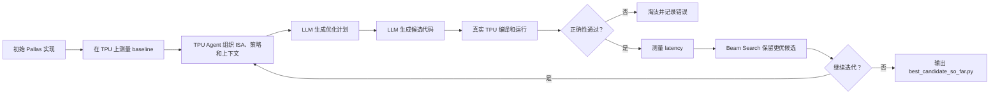
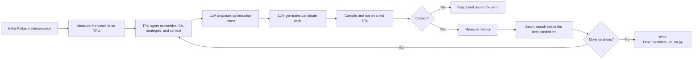

# Autocomp on TPU v6e: Bilingual User Guide

> 中文：[在 TPU 上使用 Autocomp](#中文在-tpu-上使用-autocomp)  
> English: [Using Autocomp on TPU](#english-using-autocomp-on-tpu)

This guide documents a reproducible workflow for installing and running
[Autocomp](https://github.com/ucb-bar/autocomp) directly on a Google Cloud TPU
VM, using DeepSeek as the optimization LLM and a TPU v6e-1 as the evaluation
device.

Tested configuration:

| Component       | Tested value                                           |
| --------------- | ------------------------------------------------------ |
| TPU             | Google Cloud TPU v6e-1                                 |
| Python          | 3.11                                                   |
| Autocomp commit | `a56ce8154c6992648348517489ff5db3d8267798`             |
| JAX / jaxlib    | 0.10.0                                                 |
| libtpu          | 0.0.40                                                 |
| LLM endpoint    | DeepSeek Anthropic-compatible API                      |
| Execution mode  | Autocomp and evaluation both run locally on the TPU VM |

> **Security warning:** Autocomp executes LLM-generated Python code. Use a
> dedicated or disposable TPU VM with a least-privilege service account. Do not
> expose production credentials, private datasets, or unrelated sensitive files
> to the optimization environment.

---

# 中文：在 TPU 上使用 Autocomp

## 1. Autocomp 的工作流

Autocomp 是一个由 LLM 驱动、由真实硬件反馈指导的 kernel 搜索系统。



用户需要提供三个核心文件：

```text
sols/tpu/<id>_baseline.py     # 初始实现，定义 solution(...)
harnesses/tpu/test<id>.py     # 输入、reference、正确性和性能测试
harnesses/tpu/context<id>.txt # 给 LLM 的任务描述
```

可以把它们理解为：

| 文件     | 作用                                   |
| -------- | -------------------------------------- |
| Baseline | 定义搜索从哪里开始                     |
| Harness  | 定义什么是正确，以及怎样衡量更快       |
| Context  | 告诉 LLM workload、shape、dtype 和约束 |

Harness 是最终裁判。Harness 如果不公平或不准确，Autocomp 可能会非常成功地优化错误目标。

## 2. 新建 TPU VM 后的快速配置

### 2.1 登录 TPU VM

在本地机器上：

```bash
ssh <your-tpu-ssh-alias>
```

本文后续命令默认都在 TPU VM 上执行。

检查基本环境：

```bash
hostname
python3.11 --version
df -h ~
```

### 2.2 克隆并固定 Autocomp 版本

```bash
export AUTOCOMP_COMMIT=a56ce8154c6992648348517489ff5db3d8267798

git clone https://github.com/ucb-bar/autocomp.git \
  "$HOME/autocomp-codex"

cd "$HOME/autocomp-codex"
git checkout "$AUTOCOMP_COMMIT"
git switch -c local/tpu-v6e
```

固定 commit 可以避免未来 Autocomp、JAX 或 Pallas API 变化导致环境无法复现。

如果希望使用最新 `main`，应先检查当前 TPU backend 默认的 JAX 版本：

```bash
rg -n 'AUTOCOMP_JAX_VERSION|jax_ver' \
  autocomp/backend/tpu/tpu_eval.py
```

### 2.3 创建 Python 3.11 虚拟环境

```bash
python3.11 -m venv "$HOME/.autocomp_venv"

"$HOME/.autocomp_venv/bin/python" \
  -m pip install -U pip setuptools wheel
```

### 2.4 安装 Autocomp

```bash
cd "$HOME/autocomp-codex"

"$HOME/.autocomp_venv/bin/python" \
  -m pip install -e .
```

### 2.5 安装 JAX TPU runtime

对于本文固定的 Autocomp commit，使用 JAX 0.10.0：

```bash
"$HOME/.autocomp_venv/bin/python" \
  -m pip install -U \
  'jax[tpu]==0.10.0' \
  absl-py \
  -f https://storage.googleapis.com/jax-releases/libtpu_releases.html
```

验证 TPU：

```bash
"$HOME/.autocomp_venv/bin/python" -c \
  'import jax; print("JAX:", jax.__version__); print("Devices:", jax.devices())'
```

预期输出包含：

```text
JAX: 0.10.0
Devices: [TpuDevice(id=0, ...)]
```

如果这里只出现 CPU，不要继续运行 Autocomp；先解决 JAX/libtpu/TPU runtime 问题。

## 3. 配置 DeepSeek API

Autocomp 没有独立的 `deepseek` provider，但 DeepSeek 提供 Anthropic-compatible API，可以复用 Autocomp 的 `anthropic` adapter。

### 3.1 安全保存 API key

不要把 API key 写进 Git 仓库或 `run_search.py`。

```bash
umask 077
mkdir -p "$HOME/.config/autocomp"

read -rsp 'DeepSeek API key: ' DEEPSEEK_KEY
printf '\n'
printf '%s' "$DEEPSEEK_KEY" \
  > "$HOME/.config/autocomp/deepseek_api_key"
unset DEEPSEEK_KEY

chmod 600 "$HOME/.config/autocomp/deepseek_api_key"
```

检查权限，但不要打印 key：

```bash
stat -c '%a %n' \
  "$HOME/.config/autocomp/deepseek_api_key"
```

预期权限为 `600`。

### 3.2 创建启动脚本

创建 `scripts/run_tpu_deepseek.sh`：

```bash
mkdir -p "$HOME/autocomp-codex/scripts"
```

脚本内容：

```bash
#!/usr/bin/env bash
set -euo pipefail

repo_dir="${AUTOCOMP_REPO_DIR:-$HOME/autocomp-codex}"
venv_dir="${AUTOCOMP_VENV_DIR:-$HOME/.autocomp_venv}"
key_file="${DEEPSEEK_KEY_FILE:-$HOME/.config/autocomp/deepseek_api_key}"

if [[ ! -s "$key_file" ]]; then
  echo "DeepSeek API key file is missing or empty: $key_file" >&2
  exit 1
fi

export ANTHROPIC_API_KEY="$(<"$key_file")"
export ANTHROPIC_BASE_URL="https://api.deepseek.com/anthropic"
export AUTOCOMP_TPU_TRANSPORT="local"
export AUTOCOMP_JAX_VERSION="0.10.0"
export WANDB_MODE="disabled"

cd "$repo_dir"
exec "$venv_dir/bin/python" -m autocomp.search.run_search "$@"
```

设置权限：

```bash
chmod 700 "$HOME/autocomp-codex/scripts/run_tpu_deepseek.sh"
```

这里使用 `AUTOCOMP_TPU_TRANSPORT=local`，因为 Autocomp 本身就在 TPU VM 上运行。这样每个候选不需要额外经过 SSH/SCP。

## 4. 先运行内置 TPU Matmul 样例

内置 TPU 样例由以下文件组成：

```text
sols/tpu/0_matmul_baseline.py
harnesses/tpu/test0.py
harnesses/tpu/context0.txt
```

先只运行 evaluator，不调用 LLM：

```bash
cd "$HOME/autocomp-codex"

AUTOCOMP_TPU_TRANSPORT=local \
AUTOCOMP_JAX_VERSION=0.10.0 \
AUTOCOMP_TPU_NUM_WARMUP=3 \
AUTOCOMP_TPU_NUM_TRIALS=10 \
WANDB_MODE=disabled \
"$HOME/.autocomp_venv/bin/python" \
  -m autocomp.backend.tpu.tpu_eval \
  --bench sols/tpu/0_matmul_baseline.py
```

成功时应该看到：

```text
Latency: ... ms
SUCCESS: solution() matches reference.
```

如果 baseline 无法正确运行，先不要启动 LLM 搜索。

## 5. 配置 `run_search.py`

编辑：

```text
autocomp/search/run_search.py
```

### 5.1 TPU 和问题配置

```python
backend_name = "tpu"
agent_name = "built:tpu-v6e"
simulator = None
hw_config = TpuHardwareConfig("v6e-1")

prob_type = "tpu"
prob_id = 0
```

### 5.2 DeepSeek 配置

```python
models = ["anthropic::deepseek-v4-pro"]
code_models = None
```

如果希望降低成本，可以使用当时 DeepSeek API 提供的较小模型。模型名称可能变化，使用前应查看 DeepSeek 官方文档。

### 5.3 第一次 smoke test

第一次只运行一个计划和一个实现：

```python
search_strategy = "beam"
metric = "latency"

iterations = 1
num_plan_candidates = 1
num_code_candidates = 1
beam_size = 1

dropout_menu_options = 0.25
early_stop_iters = 0
skip_planning = False

menu_strategy = None
fine_grained_isa = True
example_rate = 0.0
```

运行：

```bash
cd "$HOME/autocomp-codex"
./scripts/run_tpu_deepseek.sh
```

### 5.4 小规模正式搜索

确认 smoke test 成功后，可以增加搜索规模：

```python
iterations = 3
num_plan_candidates = 4
num_code_candidates = 1
beam_size = 2

dropout_menu_options = 0.25
early_stop_iters = 2
menu_strategy = None
example_rate = 0.0
```

### 5.5 更充分的搜索

```python
iterations = 8
num_plan_candidates = 8
num_code_candidates = 1
beam_size = 4

dropout_menu_options = 0.25
early_stop_iters = 3
menu_strategy = "one-shot"
fine_grained_isa = True
example_rate = 0.25
```

搜索规模会直接影响 LLM token、API 费用和总时间。一次最小运行也可能使用数万 token，因此应始终先 smoke test。

## 6. 定义自己的 Pallas 算子

假设使用 `prob_id=1` 定义 GEMM：

```text
sols/tpu/1_gemm_baseline.py
harnesses/tpu/test1.py
harnesses/tpu/context1.txt
```

最快的起点是复制内置样例：

```bash
cd "$HOME/autocomp-codex"

cp sols/tpu/0_matmul_baseline.py \
  sols/tpu/1_gemm_baseline.py

cp harnesses/tpu/test0.py \
  harnesses/tpu/test1.py

cp harnesses/tpu/context0.txt \
  harnesses/tpu/context1.txt
```

然后修改 shape、dtype、reference 和误差容忍度。

### 6.1 Baseline 合约

Baseline 必须定义：

```python
def solution(*inputs):
    ...
```

Autocomp 会把这个函数当作当前候选的统一入口。

### 6.2 Harness 必须定义什么

Harness 通常需要：

```python
def _create_inputs():
    ...

def _reference(*inputs):
    ...

def _run_autocomp_harness():
    ...
```

关键原则：

1. 使用确定性输入或固定随机种子。
2. 使用可信 reference。
3. 为 dtype 设置合理的 `atol` 和 `rtol`。
4. 在 warmup 中完成 JIT 编译。
5. 每次计时后调用 `jax.block_until_ready(output)`。
6. 使用多次测量的中位数，而不是单次时间。
7. 打印严格格式的 latency：

```python
print(f"Latency: {latency_ms:.3f} ms")
```

Evaluator 依赖这一行解析分数。

### 6.3 保证 JIT benchmark 公平

这是 TPU/Pallas 优化中最容易出错的地方。

推荐在 harness 中统一 JIT 所有候选：

```python
compiled_solution = jax.jit(solution)

for _ in range(NUM_WARMUP):
    out = compiled_solution(*inputs)
    jax.block_until_ready(out)

times_ms = []
for _ in range(NUM_TRIALS):
    t0 = time.perf_counter()
    out = compiled_solution(*inputs)
    jax.block_until_ready(out)
    t1 = time.perf_counter()
    times_ms.append((t1 - t0) * 1000.0)
```

如果 baseline 和候选的 JIT 边界不同，Autocomp 可能只是在优化 Python tracing/dispatch 开销，而不是真正优化 TPU kernel。

### 6.4 Context 应包含什么

示例：

```text
Optimize a Pallas GEMM kernel on a single TPU v6e-1.

Operation: C = A @ B
A shape: [4096, 4096]
B shape: [4096, 4096]
Input dtype: bfloat16
Accumulation: float32 where required for accuracy
Metric: median device latency after JIT warmup
Preserve the solution(x, y) interface.
Do not include compilation time in the benchmark.
```

明确描述：

- shape 和 batch 维度；
- dtype 和 accumulation dtype；
- layout 和 transpose 语义；
- 是否允许近似或降精度；
- 必须保持的接口；
- 真实优化指标。

最后修改 `run_search.py`：

```python
prob_type = "tpu"
prob_id = 1
```

## 7. Autocomp 每一轮做什么

一次 iteration 包含：

1. 评测当前候选或 baseline；
2. 从 TPU Agent 选择相关 ISA、策略和示例；
3. LLM 为每个 parent candidate 生成优化计划；
4. LLM 根据计划生成完整代码；
5. 在真实 TPU 上编译每个候选；
6. 运行 correctness check；
7. 对正确候选测量 latency；
8. Beam Search 保留得分最好的候选；
9. 将结果作为下一轮输入。

候选出现以下情况会被淘汰：

- Python/Pallas 编译失败；
- shape、layout 或 BlockSpec 不合法；
- 数值结果错误；
- 超时；
- 没有输出可解析的 `Latency:`；
- 正确但比当前候选更慢。

生成一个正确但更慢的候选不是系统故障。Autocomp 应拒绝它并继续保留更快的 parent。

## 8. 查看和验证结果

获取最新运行目录：

```bash
cd "$HOME/autocomp-codex"
latest_output="$(ls -dt output/* | head -1)"
echo "$latest_output"
```

主要文件：

```text
best_candidate_so_far.py       # 当前最优正确实现
generated-plans-iter-*/        # LLM 优化计划
generated-code-iter-*/         # LLM 生成代码
eval-results-iter-*/           # TPU correctness 和 benchmark 结果
candidates-iter-*/             # 每轮保留候选
run_metrics.json               # token、时间和总体指标
run_metadata.json              # 运行配置
autocomp-*-search-*.log        # 完整日志
```

查看最佳候选：

```bash
sed -n '1,280p' \
  "$latest_output/best_candidate_so_far.py"
```

重新独立验证最佳候选：

```bash
AUTOCOMP_TPU_TRANSPORT=local \
AUTOCOMP_JAX_VERSION=0.10.0 \
AUTOCOMP_TPU_NUM_WARMUP=10 \
AUTOCOMP_TPU_NUM_TRIALS=100 \
WANDB_MODE=disabled \
"$HOME/.autocomp_venv/bin/python" \
  -m autocomp.backend.tpu.tpu_eval \
  --bench "$latest_output/best_candidate_so_far.py"
```

在集成进真实模型前，还应该验证：

- 多组随机输入；
- 边界 shape；
- 真实输入 layout；
- 多次独立 benchmark；
- 与 baseline 相同的 JIT 和计时边界；
- 目标 JAX/libtpu 版本。

## 9. 仓库内的 TPU 示例

Autocomp 自带以下类型的示例。

### 9.1 可直接运行的 TPU Matmul

```text
sols/tpu/0_matmul_baseline.py
harnesses/tpu/test0.py
harnesses/tpu/context0.txt
```

### 9.2 Pallas 优化 trace

```text
examples/jaxbench-pallas/
├── flash_attention_final.py
├── flash_attention_trace.py
├── flash_attention_70b_final.py
├── flash_attention_70b_trace.py
├── ragged_paged_attention_final.py
└── ragged_paged_attention_trace.py
```

`*_trace.py` 展示逐轮计划、代码和反馈；`*_final.py` 是最终实现。

### 9.3 Vanilla JAX 到 Pallas 的翻译案例

```text
examples/jaxbench-priority/
├── mamba2_ssd_final.py
├── mamba2_ssd_trace.py
├── mla_attention_final.py
├── mla_attention_trace.py
├── retnet_retention_final.py
├── retnet_retention_trace.py
├── sparse_moe_final.py
└── sparse_moe_trace.py
```

## 10. 常见问题

### JAX 看不到 TPU

```bash
"$HOME/.autocomp_venv/bin/python" -c \
  'import jax; print(jax.devices())'
```

确认使用的是虚拟环境中的 Python，并检查 `jax`、`jaxlib`、`libtpu` 和 TPU VM runtime 是否兼容。

### Baseline latency 异常大

首先检查 JIT 边界。确保首次编译在 warmup，正式计时只测量已经编译的调用。

### Autocomp 找不到 latency

Harness 必须打印：

```text
Latency: <number> ms
```

### DeepSeek API 不可用

检查：

```bash
test -s "$HOME/.config/autocomp/deepseek_api_key"
echo "$?"
```

确认启动脚本设置了：

```bash
ANTHROPIC_API_KEY
ANTHROPIC_BASE_URL=https://api.deepseek.com/anthropic
```

不要打印实际 key。

### 候选全部编译失败

检查：

```text
output/<run>/eval-results-iter-*/code_*_result_full.txt
```

常见原因包括错误的 Pallas API、非法 BlockSpec、VMEM 超限、grid semantics 错误以及 shape 不满足 tile divisibility。

### 上一次搜索是否仍在运行

```bash
pgrep -af 'autocomp.search.run_search'
```

不要同时在单个 v6e-1 上启动多个搜索，它们会互相干扰 latency。

## 11. 新 TPU VM 检查清单

- [ ] 使用 Python 3.11。
- [ ] 克隆并固定 Autocomp commit。
- [ ] 创建 `~/.autocomp_venv`。
- [ ] `pip install -e .`。
- [ ] 安装匹配的 `jax[tpu]`、jaxlib 和 libtpu。
- [ ] `jax.devices()` 显示 TPU。
- [ ] 将 DeepSeek key 存放在仓库外，权限为 `600`。
- [ ] 设置 `ANTHROPIC_BASE_URL` 和 `ANTHROPIC_API_KEY`。
- [ ] 设置 `AUTOCOMP_TPU_TRANSPORT=local`。
- [ ] 设置与代码一致的 `AUTOCOMP_JAX_VERSION`。
- [ ] 先单独运行 baseline evaluator。
- [ ] 再运行 1 iteration smoke test。
- [ ] 检查 correctness、latency、生成代码和日志。
- [ ] 扩大搜索前估算 LLM token/API 成本。
- [ ] 最佳候选必须独立重新验证后才能集成。

---

# English: Using Autocomp on TPU

## 1. How the workflow works

Autocomp is an LLM-driven kernel search system guided by measurements from real hardware.



Each TPU problem consists of three primary files:

```text
sols/tpu/<id>_baseline.py     # Initial implementation with solution(...)
harnesses/tpu/test<id>.py     # Inputs, reference, correctness, and timing
harnesses/tpu/context<id>.txt # Natural-language workload description
```

| File     | Purpose                                                      |
| -------- | ------------------------------------------------------------ |
| Baseline | Defines where search starts                                  |
| Harness  | Defines correctness and the optimization metric              |
| Context  | Explains shapes, dtypes, semantics, and constraints to the LLM |

The harness is the final judge. An inaccurate or unfair harness can cause Autocomp to optimize the wrong objective very effectively.

## 2. Bootstrap a new TPU VM

### 2.1 Log in

From the local workstation:

```bash
ssh <your-tpu-ssh-alias>
```

All remaining commands in this guide run on the TPU VM.

```bash
hostname
python3.11 --version
df -h ~
```

### 2.2 Clone and pin Autocomp

```bash
export AUTOCOMP_COMMIT=a56ce8154c6992648348517489ff5db3d8267798

git clone https://github.com/ucb-bar/autocomp.git \
  "$HOME/autocomp-codex"

cd "$HOME/autocomp-codex"
git checkout "$AUTOCOMP_COMMIT"
git switch -c local/tpu-v6e
```

Pinning the commit prevents future Autocomp, JAX, or Pallas changes from silently breaking reproducibility.

When using a newer commit, inspect its expected JAX version first:

```bash
rg -n 'AUTOCOMP_JAX_VERSION|jax_ver' \
  autocomp/backend/tpu/tpu_eval.py
```

### 2.3 Create the Python environment

```bash
python3.11 -m venv "$HOME/.autocomp_venv"

"$HOME/.autocomp_venv/bin/python" \
  -m pip install -U pip setuptools wheel
```

### 2.4 Install Autocomp

```bash
cd "$HOME/autocomp-codex"

"$HOME/.autocomp_venv/bin/python" \
  -m pip install -e .
```

### 2.5 Install the TPU runtime

The pinned commit in this guide is tested with JAX 0.10.0:

```bash
"$HOME/.autocomp_venv/bin/python" \
  -m pip install -U \
  'jax[tpu]==0.10.0' \
  absl-py \
  -f https://storage.googleapis.com/jax-releases/libtpu_releases.html
```

Verify device detection:

```bash
"$HOME/.autocomp_venv/bin/python" -c \
  'import jax; print("JAX:", jax.__version__); print("Devices:", jax.devices())'
```

Expected output includes:

```text
JAX: 0.10.0
Devices: [TpuDevice(id=0, ...)]
```

Do not start Autocomp until JAX sees the TPU rather than only a CPU.

## 3. Configure DeepSeek

Autocomp has no dedicated `deepseek` provider, but DeepSeek exposes an Anthropic-compatible endpoint that works with Autocomp's `anthropic` adapter.

### 3.1 Store the key outside the repository

```bash
umask 077
mkdir -p "$HOME/.config/autocomp"

read -rsp 'DeepSeek API key: ' DEEPSEEK_KEY
printf '\n'
printf '%s' "$DEEPSEEK_KEY" \
  > "$HOME/.config/autocomp/deepseek_api_key"
unset DEEPSEEK_KEY

chmod 600 "$HOME/.config/autocomp/deepseek_api_key"
```

Verify permissions without printing the key:

```bash
stat -c '%a %n' \
  "$HOME/.config/autocomp/deepseek_api_key"
```

### 3.2 Create a launcher

Create `scripts/run_tpu_deepseek.sh`:

```bash
#!/usr/bin/env bash
set -euo pipefail

repo_dir="${AUTOCOMP_REPO_DIR:-$HOME/autocomp-codex}"
venv_dir="${AUTOCOMP_VENV_DIR:-$HOME/.autocomp_venv}"
key_file="${DEEPSEEK_KEY_FILE:-$HOME/.config/autocomp/deepseek_api_key}"

if [[ ! -s "$key_file" ]]; then
  echo "DeepSeek API key file is missing or empty: $key_file" >&2
  exit 1
fi

export ANTHROPIC_API_KEY="$(<"$key_file")"
export ANTHROPIC_BASE_URL="https://api.deepseek.com/anthropic"
export AUTOCOMP_TPU_TRANSPORT="local"
export AUTOCOMP_JAX_VERSION="0.10.0"
export WANDB_MODE="disabled"

cd "$repo_dir"
exec "$venv_dir/bin/python" -m autocomp.search.run_search "$@"
```

```bash
chmod 700 "$HOME/autocomp-codex/scripts/run_tpu_deepseek.sh"
```

`AUTOCOMP_TPU_TRANSPORT=local` is used because both the orchestrator and evaluator run on the TPU VM. It avoids SSH/SCP overhead for every generated candidate.

## 4. Run the built-in TPU Matmul baseline

The built-in problem consists of:

```text
sols/tpu/0_matmul_baseline.py
harnesses/tpu/test0.py
harnesses/tpu/context0.txt
```

Test the evaluator without calling the LLM:

```bash
cd "$HOME/autocomp-codex"

AUTOCOMP_TPU_TRANSPORT=local \
AUTOCOMP_JAX_VERSION=0.10.0 \
AUTOCOMP_TPU_NUM_WARMUP=3 \
AUTOCOMP_TPU_NUM_TRIALS=10 \
WANDB_MODE=disabled \
"$HOME/.autocomp_venv/bin/python" \
  -m autocomp.backend.tpu.tpu_eval \
  --bench sols/tpu/0_matmul_baseline.py
```

A successful run prints:

```text
Latency: ... ms
SUCCESS: solution() matches reference.
```

Fix baseline failures before starting an LLM search.

## 5. Configure the search

Edit:

```text
autocomp/search/run_search.py
```

### 5.1 Target and problem

```python
backend_name = "tpu"
agent_name = "built:tpu-v6e"
simulator = None
hw_config = TpuHardwareConfig("v6e-1")

prob_type = "tpu"
prob_id = 0
```

### 5.2 Model

```python
models = ["anthropic::deepseek-v4-pro"]
code_models = None
```

Model names may change. Check the current DeepSeek documentation before provisioning a fresh environment.

### 5.3 Minimal smoke test

```python
search_strategy = "beam"
metric = "latency"

iterations = 1
num_plan_candidates = 1
num_code_candidates = 1
beam_size = 1

dropout_menu_options = 0.25
early_stop_iters = 0
skip_planning = False

menu_strategy = None
fine_grained_isa = True
example_rate = 0.0
```

Run:

```bash
cd "$HOME/autocomp-codex"
./scripts/run_tpu_deepseek.sh
```

### 5.4 Small search

```python
iterations = 3
num_plan_candidates = 4
num_code_candidates = 1
beam_size = 2

dropout_menu_options = 0.25
early_stop_iters = 2
menu_strategy = None
example_rate = 0.0
```

### 5.5 Larger search

```python
iterations = 8
num_plan_candidates = 8
num_code_candidates = 1
beam_size = 4

dropout_menu_options = 0.25
early_stop_iters = 3
menu_strategy = "one-shot"
fine_grained_isa = True
example_rate = 0.25
```

Search size directly affects LLM tokens, API cost, and runtime. Even a one-candidate run may use tens of thousands of tokens, so always begin with a smoke test.

## 6. Add a custom Pallas operator

For a GEMM assigned `prob_id=1`, create:

```text
sols/tpu/1_gemm_baseline.py
harnesses/tpu/test1.py
harnesses/tpu/context1.txt
```

The fastest starting point is the built-in Matmul example:

```bash
cd "$HOME/autocomp-codex"

cp sols/tpu/0_matmul_baseline.py \
  sols/tpu/1_gemm_baseline.py

cp harnesses/tpu/test0.py \
  harnesses/tpu/test1.py

cp harnesses/tpu/context0.txt \
  harnesses/tpu/context1.txt
```

Update the shapes, dtypes, reference implementation, and tolerances.

### 6.1 Baseline contract

The baseline must define:

```python
def solution(*inputs):
    ...
```

### 6.2 Harness requirements

A typical harness defines:

```python
def _create_inputs():
    ...

def _reference(*inputs):
    ...

def _run_autocomp_harness():
    ...
```

Requirements:

1. Use deterministic inputs or fixed random seeds.
2. Use a trusted reference implementation.
3. Choose appropriate `atol` and `rtol` values for the dtype.
4. Compile during warmup.
5. Call `jax.block_until_ready(output)` for every timed execution.
6. Use a median over multiple trials.
7. Print latency using the exact parseable format:

```python
print(f"Latency: {latency_ms:.3f} ms")
```

### 6.3 Keep the JIT boundary fair

A recommended harness pattern is:

```python
compiled_solution = jax.jit(solution)

for _ in range(NUM_WARMUP):
    out = compiled_solution(*inputs)
    jax.block_until_ready(out)

times_ms = []
for _ in range(NUM_TRIALS):
    t0 = time.perf_counter()
    out = compiled_solution(*inputs)
    jax.block_until_ready(out)
    t1 = time.perf_counter()
    times_ms.append((t1 - t0) * 1000.0)
```

If the baseline and candidates use different JIT boundaries, Autocomp may optimize Python tracing/dispatch overhead instead of TPU kernel execution.

### 6.4 Write useful context

```text
Optimize a Pallas GEMM kernel on a single TPU v6e-1.

Operation: C = A @ B
A shape: [4096, 4096]
B shape: [4096, 4096]
Input dtype: bfloat16
Accumulation: float32 where required for accuracy
Metric: median device latency after JIT warmup
Preserve the solution(x, y) interface.
Do not include compilation time in the benchmark.
```

Include shapes, batch dimensions, dtypes, accumulation type, layouts, transpose semantics, accuracy constraints, required interfaces, and the actual optimization metric.

Finally select the problem:

```python
prob_type = "tpu"
prob_id = 1
```

## 7. What happens in each iteration

Each iteration performs the following steps:

1. Evaluate the current candidates or baseline.
2. Select relevant ISA sections, strategies, and examples from the TPU agent.
3. Generate optimization plans for each parent candidate.
4. Generate complete candidate implementations.
5. Compile every candidate on the real TPU.
6. Run the correctness check.
7. Benchmark correct candidates.
8. Keep the best candidates in the beam.
9. Feed those candidates into the next iteration.

Candidates are rejected when they:

- fail Python or Pallas compilation;
- use invalid shapes, layouts, or BlockSpecs;
- produce incorrect numerical results;
- time out;
- do not print a parseable `Latency:` line; or
- are correct but slower than the retained candidates.

A correct but slower generated implementation is not a system failure. Autocomp should reject it and retain the faster parent.

## 8. Inspect and validate results

Locate the newest output:

```bash
cd "$HOME/autocomp-codex"
latest_output="$(ls -dt output/* | head -1)"
echo "$latest_output"
```

Important files:

```text
best_candidate_so_far.py       # Best correct implementation so far
generated-plans-iter-*/        # LLM optimization plans
generated-code-iter-*/         # Generated implementations
eval-results-iter-*/           # TPU correctness and timing results
candidates-iter-*/             # Candidates retained after each iteration
run_metrics.json               # Token, time, and aggregate metrics
run_metadata.json              # Run configuration
autocomp-*-search-*.log        # Full log
```

Inspect the best candidate:

```bash
sed -n '1,280p' \
  "$latest_output/best_candidate_so_far.py"
```

Rebenchmark it independently:

```bash
AUTOCOMP_TPU_TRANSPORT=local \
AUTOCOMP_JAX_VERSION=0.10.0 \
AUTOCOMP_TPU_NUM_WARMUP=10 \
AUTOCOMP_TPU_NUM_TRIALS=100 \
WANDB_MODE=disabled \
"$HOME/.autocomp_venv/bin/python" \
  -m autocomp.backend.tpu.tpu_eval \
  --bench "$latest_output/best_candidate_so_far.py"
```

Before integrating the result, test multiple random inputs, edge shapes, production layouts, repeated benchmark runs, identical baseline/candidate JIT boundaries, and the target JAX/libtpu version.

## 9. Included examples

### 9.1 Runnable TPU Matmul

```text
sols/tpu/0_matmul_baseline.py
harnesses/tpu/test0.py
harnesses/tpu/context0.txt
```

### 9.2 Pallas optimization traces

```text
examples/jaxbench-pallas/
├── flash_attention_final.py
├── flash_attention_trace.py
├── flash_attention_70b_final.py
├── flash_attention_70b_trace.py
├── ragged_paged_attention_final.py
└── ragged_paged_attention_trace.py
```

`*_trace.py` files preserve the iterative plans, implementations, and feedback. `*_final.py` files contain final implementations.

### 9.3 Vanilla JAX-to-Pallas examples

```text
examples/jaxbench-priority/
├── mamba2_ssd_final.py
├── mamba2_ssd_trace.py
├── mla_attention_final.py
├── mla_attention_trace.py
├── retnet_retention_final.py
├── retnet_retention_trace.py
├── sparse_moe_final.py
└── sparse_moe_trace.py
```

## 10. Troubleshooting

### JAX does not see a TPU

```bash
"$HOME/.autocomp_venv/bin/python" -c \
  'import jax; print(jax.devices())'
```

Make sure the virtual-environment Python is used and that `jax`, `jaxlib`, `libtpu`, and the TPU VM runtime are compatible.

### Baseline latency is unexpectedly large

Check the JIT boundary first. Compilation should happen during warmup, while timed trials should execute an already-compiled function.

### Autocomp cannot parse latency

The harness must print:

```text
Latency: <number> ms
```

### DeepSeek is unavailable

Check the key file without displaying it:

```bash
test -s "$HOME/.config/autocomp/deepseek_api_key"
echo "$?"
```

Ensure the launcher sets:

```bash
ANTHROPIC_API_KEY
ANTHROPIC_BASE_URL=https://api.deepseek.com/anthropic
```

### All candidates fail compilation

Inspect:

```text
output/<run>/eval-results-iter-*/code_*_result_full.txt
```

Common causes include hallucinated Pallas APIs, invalid BlockSpecs, VMEM overuse, incorrect grid semantics, and shapes that are not divisible by tile sizes.

### Check for an existing search process

```bash
pgrep -af 'autocomp.search.run_search'
```

Do not run multiple searches concurrently on one v6e-1, because they will contaminate latency measurements.

## 11. Fresh-VM checklist

- [ ] Use Python 3.11.
- [ ] Clone and pin an Autocomp commit.
- [ ] Create `~/.autocomp_venv`.
- [ ] Run `pip install -e .`.
- [ ] Install matching `jax[tpu]`, jaxlib, and libtpu versions.
- [ ] Confirm that `jax.devices()` reports the TPU.
- [ ] Store the DeepSeek key outside the repository with mode `600`.
- [ ] Set `ANTHROPIC_BASE_URL` and `ANTHROPIC_API_KEY`.
- [ ] Set `AUTOCOMP_TPU_TRANSPORT=local`.
- [ ] Set the matching `AUTOCOMP_JAX_VERSION`.
- [ ] Run the baseline evaluator without an LLM first.
- [ ] Run a one-iteration smoke test.
- [ ] Inspect correctness, latency, generated code, and logs.
- [ ] Estimate LLM token/API cost before scaling the search.
- [ ] Independently revalidate the best candidate before integration.

---

## References

- [Autocomp repository](https://github.com/ucb-bar/autocomp)
- [Autocomp TPU backend setup](https://github.com/ucb-bar/autocomp/blob/main/autocomp/backend/tpu/tpu_setup.md)
- [Autocomp TPU blog post](https://charleshong3.github.io/blog/autocomp_tpu.html)
- [JAX Pallas documentation](https://docs.jax.dev/en/latest/pallas/index.html)
- [DeepSeek API documentation](https://api-docs.deepseek.com/)
- [JAXBench / Accelerator Agents](https://github.com/AI-Hypercomputer/accelerator-agents)

